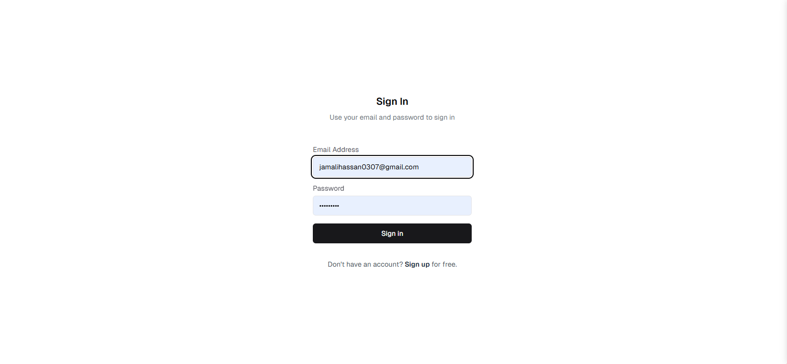
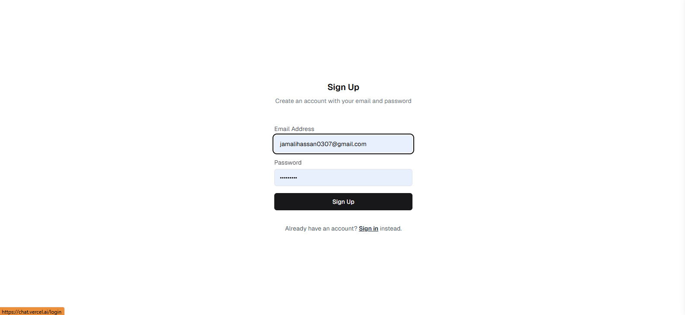
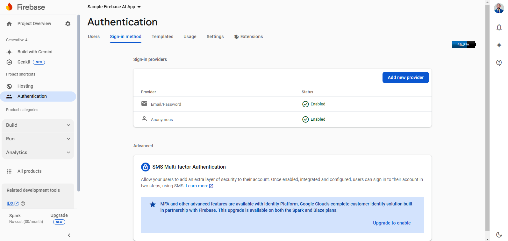
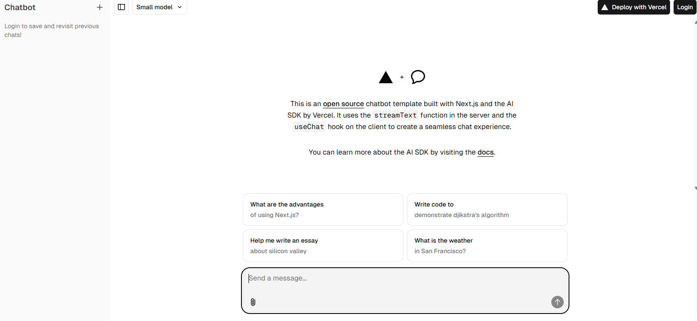
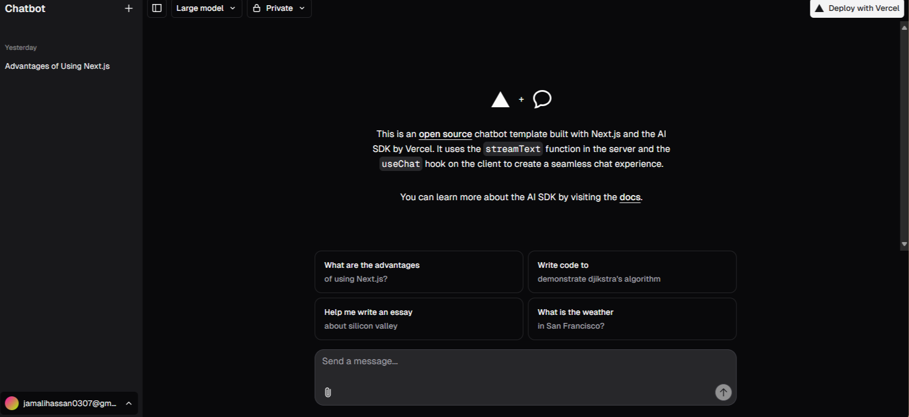
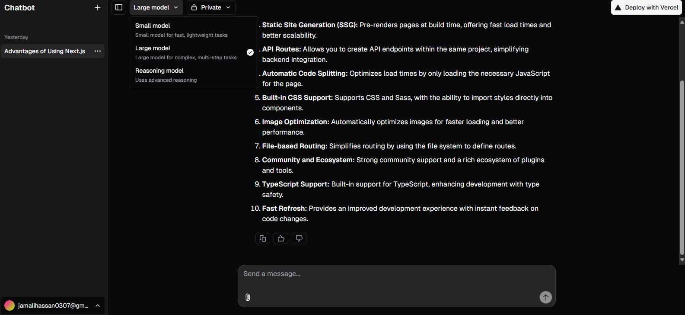
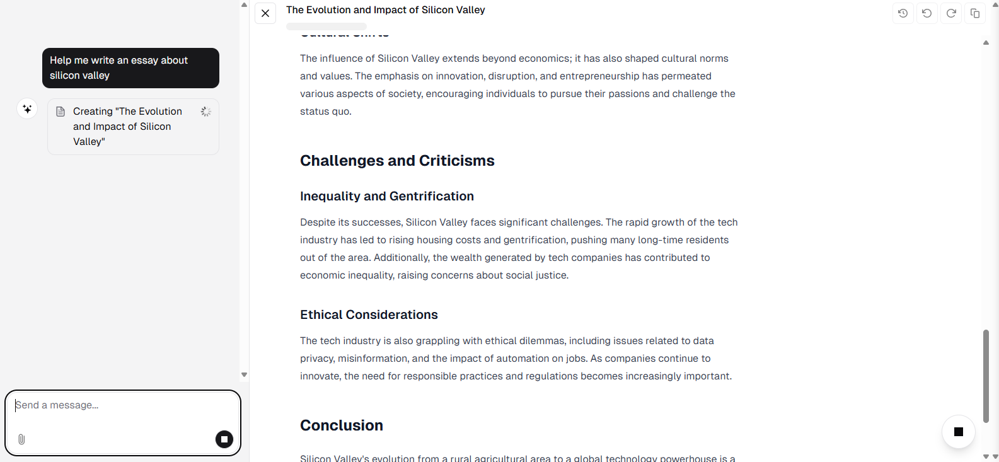
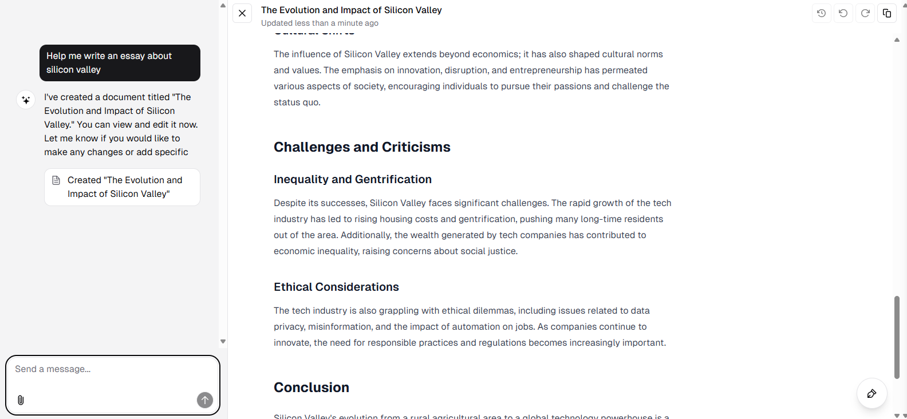
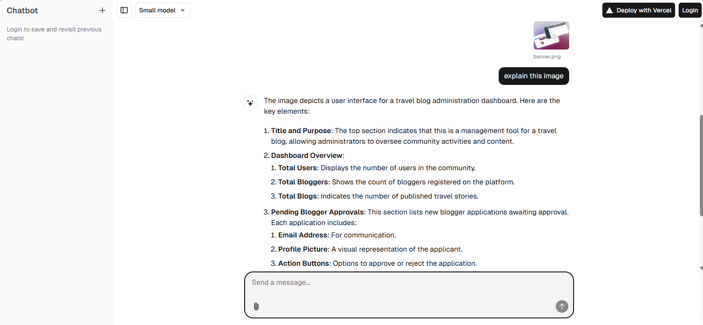

# 

  <h1>🤖 Next.js AI Chatbot</h1>
  <h3>A Modern AI-Powered Chat Application with Firebase Authentication</h3>

    
    
    

# 📌 Overview

Next.js AI Chatbot is a sophisticated web application that combines the power of Google's Gemini AI with Next.js and Firebase authentication. Users can engage in intelligent conversations, generate content, and manage their chat history in a secure environment.

# 🛠️ Tech Stack

## 🔑 Key Features

### Authentication System

- Secure Firebase Authentication
- Email/Password and Anonymous login options
- User profile management
- Protected routes and API endpoints

### AI Integration

- Powered by Google's Gemini AI
- Intelligent conversation capabilities
- Content generation features
- Real-time response streaming

### User Experience

- Dark/Light theme support
- Responsive design
- Real-time chat interface
- Message history persistence
- Loading states and error handling

## 📸 Screenshots & Workflow

### 1. Authentication Flow

  
  
Secure login interface with email/password authentication

  
  
  
User registration with Firebase Authentication

  
  
  
Firebase Authentication Dashboard showing user management

### 2. Chat Interface

  
  
Initial chat interface for non-authenticated users

  
  
  
Dark mode chat interface showing AI responses

  
  
  
Interactive chat session with AI responses

### 3. Response Generation

  
  
AI processing and generating responses

  
  
  
Detailed AI-generated content with formatting

  
  
  
Code generation and technical responses

### 4. User Features

  
  
AI-powered image analysis and description

  
  
  
Detailed image analysis results

## 🚀 Getting Started

1. Clone the repository:
   \`\`\`bash
   git clone https://github.com/jamalihassan0307/nextjs-ai-chatbot.git
   \`\`\`

2. Install dependencies:
   \`\`\`bash
   npm install
   \`\`\`

3. Set up environment variables in \`.env.local\`:
   \`\`\`env
   NEXT_PUBLIC_FIREBASE_API_KEY=your_firebase_api_key
   NEXT_PUBLIC_FIREBASE_AUTH_DOMAIN=your_firebase_auth_domain
   NEXT_PUBLIC_FIREBASE_PROJECT_ID=your_project_id
   GEMINI_API_KEY=your_gemini_api_key
   \`\`\`

4. Run the development server:
   \`\`\`bash
   npm run dev
   \`\`\`

## 👨‍💻 Developer Contact

Feel free to reach out for questions or collaboration:

- GitHub: [@jamalihassan0307](https://github.com/jamalihassan0307)
- LinkedIn: [Jamali Hassan](https://www.linkedin.com/in/jamalihassan0307/)

## 🙏 Acknowledgments

Special thanks to:

- Google Cloud team for Gemini AI
- Firebase team for Authentication services
- Vercel for hosting and deployment
- The open-source community
